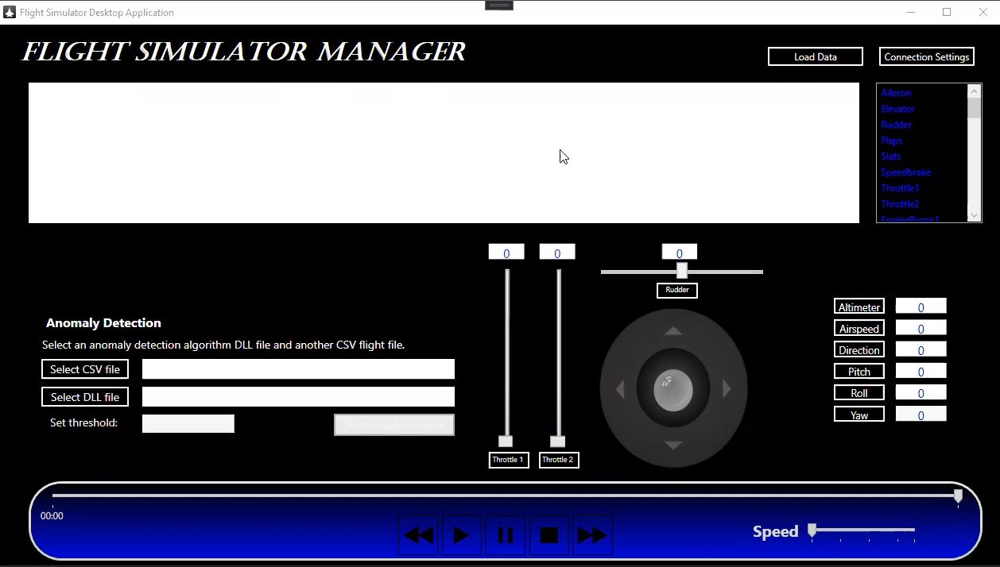
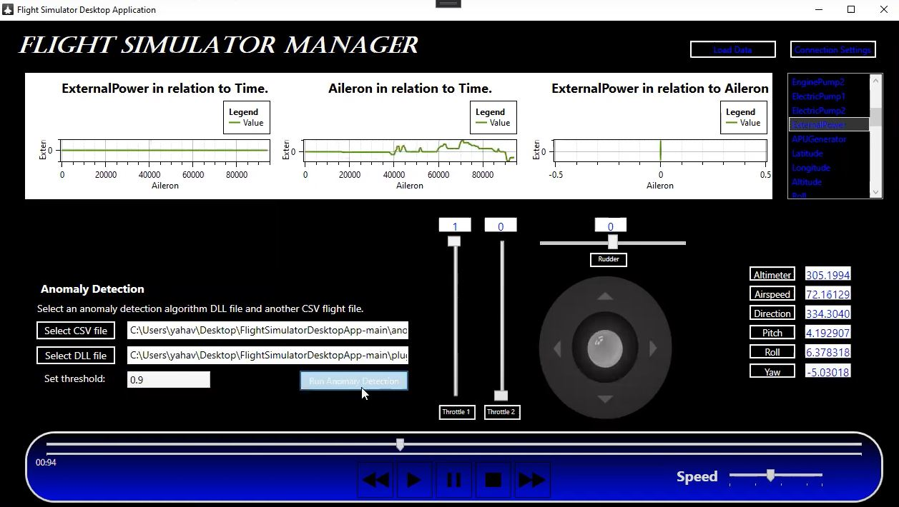
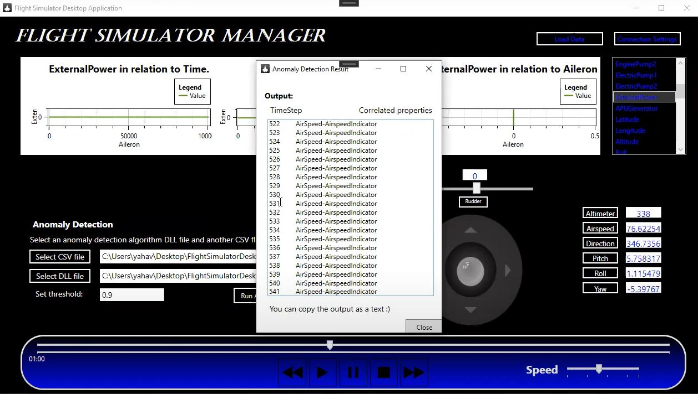

# Flight Simulator Desktop App

About

This project is a flight simulator desktop app, displayed by FlightGear.
In this project, we implemented flight simulator features according to user stories.

We build this project based on MVVM architecture as follow:

- Model - refers either to a domain model, which represents real state content.
  There are 5 model classes:
  1. FlightSimulatorModel - the main model, all simulator properties are located there also the main functionality.
  2. ConnectionModel - model that contains the connection settings and functionality that required to connect between FlightGear application and our project
  3. DataModel - used as a database, dedicated location to CSV data
  4. GraphsModel - all data refers to build graphs according to user requests
  5. AnomalyDetectionModel - base functionality to activate Anomaly detection algorithms given by dll files

- View - the view is the structure, layout, and appearance of what a user sees on the screen.
  For each object in the main window, we created a dedicated view class to maintain correct programming principles so that each part will stand on its own and not be dependent on   others. Finally, all the parts are connected together under the main window view class.
  Each view class has its ViewModel connector.
  
- ViewModel - an abstraction of the view exposing public properties and commands.
  We created 7 ViewModel classes, one for each Model class, and 2 additionals.
  1. FlightSimulatorViewModel - the main viewModel, creates the unique models and contains the details that connects the modules.
  2. ConnectionViewModel
  3. DataViewModel
  4. GraphsViewModel
  5. AnomalyDetectionViewModel
  6. PlayerViewModel - connects between the main model to the player controls. They are all based on the main thread settings and some additional properties that activate the simulator
  7. ControllersViewModel - connects between the main model properties and the dashboard values and joystick movement.

Below is our Features list:
- Connection settings - IP & Port
- Load CSV
- Simulator player (Play, Pause, Stop, Forward, Reverse)
- Joystick
- Controllers
- Graphs
- 2 Anomaly detection Algorithms

Tools & Frameworks:
OxyPlot
WPF

Instructions:
1. Please download FlightGear application from: https://www.flightgear.org/
2. Define FlightGear settings as follow: 
	--generic=socket,in,10,127.0.0.1,5400,tcp,playback_small
--fdm=null
3. Download "FlightGearDesktopApp" project to Visual Studio
4. Press Play and enjoy :)

Also we would like to share with you our trial video,
https://youtu.be/kW73YUJgMZo

